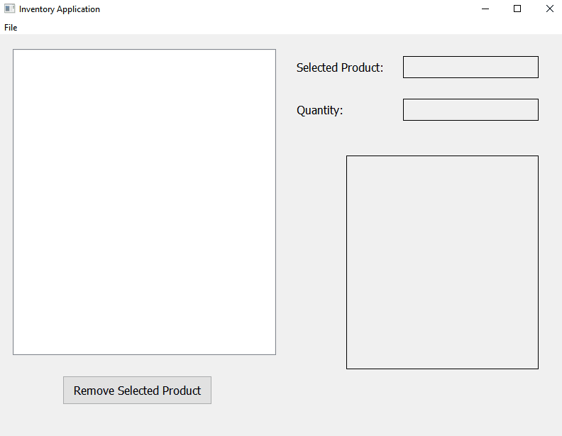

# Inventory Application

**This Inventory application** is a desktop application built in C++ using the Qt framework. The GUI serves as an interface for a store inventory system.

## Features

* [ ] Event driven application that can track names, quantities and images for different products.
* [ ] File I/O for Save and Load functionality.
* [ ] Persistent data and memory management using raw pointers. Smart pointers were neglected on purpose to help better understand and become 
more comfortable with pointers in C++.

